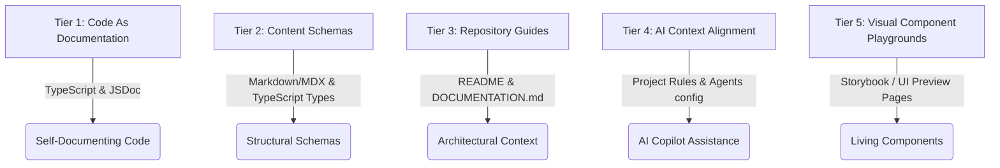

# Project Documentation Strategy & Codebase Architecture Guide

Welcome to the documentation guide for the **Rajeev Ranjan Portfolio** codebase. This document outlines the best solution for keeping this project documented, followed by a complete reference of the project's current structure, schemas, and development workflows.

---

## Part 1: The Documentation Solution (Best Practices)

To keep a modern Next.js + TypeScript project fully documented without it becoming a chore or getting out of date, we recommend a **Tiered Documentation Strategy**:



### 1. Tier 1: Self-Documenting Code (TypeScript & JSDoc)
*   **TypeScript Types/Interfaces**: Define clear types for all component props and configurations. This provides autocomplete and runtime-like confidence inside modern editors.
*   **JSDoc Comments**: Document component interfaces and complex function logic using JSDoc.
    ```tsx
    /**
     * Renders a card displaying project details with hover animations.
     * @param props - The properties for the project card.
     * @param props.title - The title of the project.
     * @param props.description - Brief text explaining the project.
     * @param props.technologies - List of technology badges to render.
     */
    export function ProjectCard({ title, description, technologies }: ProjectCardProps) { ... }
    ```

### 2. Tier 2: Structural Content Schemas
*   Maintain strict schemas for all external content (like blog posts and configuration files).
*   Document these frontmatter schemas and configurations (see Part 3 below) so that any future changes (e.g., adding a new job, project, or blog post) follow the exact structure.

### 3. Tier 3: Repository & Architectural Guides
*   **`README.md`**: Focuses on quick setup, installation, and deployment.
*   **`DOCUMENTATION.md`** (This file): Focuses on the "why" and "how" of the architecture, acting as a developer reference manual.

### 4. Tier 4: AI Context Alignment (Modern Best Practice)
*   Create a `.cursorrules` or `.agents/AGENTS.md` file in the repository root.
*   This file lists coding preferences (e.g., "Use TypeScript, use React hooks, style using Tailwind CSS, structure pages using App Router"). AI code assistants will automatically read these rules and write code conforming to your standards, keeping documentation and code style unified.

### 5. Tier 5: Living Component Playgrounds
*   For UI components, keeping static documentation is hard. Consider:
    *   **Storybook** (`npx sb init`): Excellent for isolating and testing UI components in various states.
    *   **Dev Playgrounds**: Creating a route like `/preview` that renders all variants of components (`blur-fade`, `project-card`, etc.) to visually verify them.

---

## Part 2: Codebase Architecture & Directory Structure

The repository is structured as a modern **Next.js App Router** application using Tailwind CSS for styling and TypeScript for static typing.

```
rajeev-portfolio/
├── content/                     # MDX Blog posts
│   └── hello-world.mdx          # Individual blog articles
├── public/                      # Static assets (images, avatars, logos)
├── src/
│   ├── app/                     # Next.js App Router folders
│   │   ├── blog/                # Blog listing and dynamic post reader [slug]
│   │   ├── privacy-policy/      # Legal privacy policy page
│   │   ├── globals.css          # Global Tailwind styles
│   │   ├── layout.tsx           # Global Root Layout
│   │   └── page.tsx             # Main Portfolio landing page
│   ├── components/              # Reusable UI widgets
│   │   ├── magicui/             # Visual animation components (e.g., blur-fade)
│   │   ├── ui/                  # Base Radix & Custom UI elements (buttons, tooltips)
│   │   ├── icons.tsx            # SVG Icon dictionary
│   │   ├── mdx.tsx              # MDX custom HTML elements renderer
│   │   └── navbar.tsx           # Floating responsive navigation bar
│   ├── data/                    # Configuration-driven content definitions
│   │   ├── blog.ts              # File parser & Markdown-to-HTML converter
│   │   └── resume.tsx           # MAIN CONFIGURATION: All portfolio data resides here
│   └── lib/                     # Helper utility functions
│       └── utils.ts             # CN utility class merger
├── components.json              # Shadcn/UI configuration
├── tailwind.config.ts           # Tailwind custom animations & theme
└── tsconfig.json                # TypeScript compilation config
```

### Key Mechanisms:
1.  **Config-Driven Portfolio**: The homepage (`src/app/page.tsx`) reads directly from `src/data/resume.tsx`. Updating `resume.tsx` modifies your bio, links, experiences, skills, and projects without touching any HTML/TSX code.
2.  **MDX Blog Engine**: The blog parses Markdown metadata (frontmatter) and markdown content using `gray-matter` and `unified` inside `src/data/blog.ts`, converting it into raw HTML rendered inside the dynamic `src/app/blog/[slug]/page.tsx` route. Code blocks are automatically highlighted using `rehype-pretty-code` and `shiki`.

---

## Part 3: Schema Definitions

### 1. Resume Schema (`src/data/resume.tsx`)
The `DATA` object must conform to the following schema structure:

| Field | Type | Description |
| :--- | :--- | :--- |
| `name` | `string` | Your full name |
| `initials` | `string` | Initials used in avatars/logos |
| `url` | `string` | Base URL of the website or GitHub profile |
| `location` | `string` | City and country |
| `locationLink` | `string` | Google Maps link to city |
| `description` | `string` | Short tagline or professional subtitle |
| `summary` | `string` | Paragraph bio (supports inline HTML like `<b>`) |
| `avatarUrl` | `string` | Path to profile image (placed in `/public`) |
| `skills` | `Array<{ title: string, icon: string }>` | List of technical skills with Iconify icons |
| `navbar` | `Array<{ href: string, icon: LucideIcon, label: string }>` | Links in the navigation dock |
| `contact` | `Object` | Object containing `email`, `tel`, and `social` platform objects |
| `work` | `Array<WorkExperience>` | Structured professional history (see below) |
| `education`| `Array<EducationHistory>` | Academic details (see below) |
| `projects` | `Array<Project>` | Showcased projects details (see below) |

#### Detail Types:
```typescript
interface WorkExperience {
  company: string;
  title: string;
  start: string;
  end: string;
  location?: string;
  logoUrl?: string; // Appears on the left side of card
  description: string;
  badges?: string[];
  href?: string;
}

interface EducationHistory {
  school: string;
  degree: string;
  start: string;
  end: string;
  logoUrl?: string;
  href?: string;
}

interface Project {
  title: string;
  href: string; // Project link
  dates: string;
  active: boolean; // Controls rendering
  description: string;
  technologies: string[]; // Badge text list
  links?: Array<{ icon: React.ReactNode, type: string, href: string }>;
  image?: string; // Preview image path
  video?: string; // Optional showcase video path
}
```

### 2. Blog MDX Schema (MDX Files in `content/*.mdx`)
Every blog post must begin with standard YAML frontmatter:
```yaml
---
title: "Title of the Post"
publishedAt: "YYYY-MM-DD"
summary: "Short one-sentence summary for the post feed."
image: "/optional-og-image.png"
---
```
Following the frontmatter, you can write standard Markdown or HTML. MDX supports fenced code blocks with language specifiers, which will render with syntax highlighting.

---

## Part 4: Developer Workflows & Checklists

### 1. Starting the Application
For local development:
```bash
npm run dev
```

For production builds (recommended flow):
1. Compile the optimized build first:
   ```bash
   npm run build
   ```
2. Start the built production server:
   ```bash
   npm start
   ```

### 2. Adding a New Blog Post
1. Navigate to `/content`.
2. Create a new file named `your-post-slug.mdx`.
3. Add the required frontmatter block at the top.
4. Write content using Markdown.
5. Run the dev server (`npm run dev`) and visit `http://localhost:3000/blog` to verify.

### 3. Updating Profile/Resume Information
1. Open [resume.tsx](file:///Users/rajeevranjan/Desktop/ALL%20Project/rajeev-portfolio/src/data/resume.tsx).
2. Locate the section you want to modify (e.g., `DATA.work`, `DATA.skills`, `DATA.projects`).
3. Add or modify the fields complying with the schemas detailed in Part 3.
4. If adding assets (e.g., logos or screenshots), place them in `/public/logos` or `/public/projects` and reference them starting with `/` (e.g., `/logos/mylogo.png`).

### 4. Adding New UI Components
1. Place UI components in [src/components](file:///Users/rajeevranjan/Desktop/ALL%20Project/rajeev-portfolio/src/components) or a subfolder.
2. Export props interface and utilize TypeScript for prop validation.
3. Add JSDoc comments to document props and key interactions.
4. Make sure components are fully responsive (using Tailwind responsive breakpoints `sm:`, `md:`, `lg:`).

